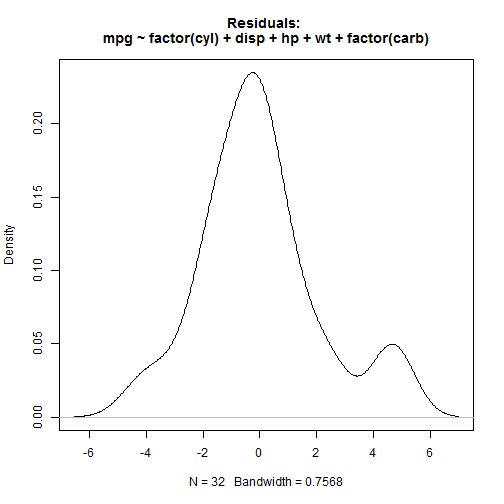

## 1. Main Idea

Have you ever thought about studying the mtcars dataset?
Well, probably no, but if you're attending a course on coursera it would be a nice idea to have a little application that can do the easiest calculations straight away for YOU.

See now the fantastic new functionalities we give you to study the mtcars dataset in new marvelous, curious and interesting ways.

--- .class #id 

## 2. Freedom

Know everything about how the mpg variable of the mtcars dataset is related to the other variables.
How can you realize this dream?

Well, it's easy: TO KNOW EVERYTHING CHECK EVERYTHING!

--- .class #id 

## 3. Results!

And the first thing you obtain is... let me see.. RESULTS!

--- .class #id 

## 4. Graphs! Graphs! GRAPHS!!

Study how every variable is related to the mpg variable with wonderful exploratory graphs! 

 

--- .class #id 

## 5. Don't Touch My Residuals!

See how good-looking is your fit observing YOUR meaningful residual graph! 

 

